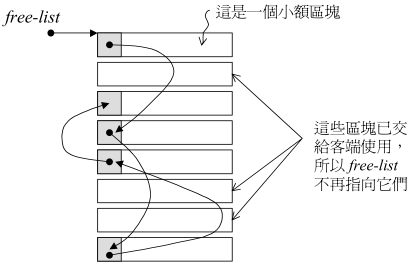

# C++面试常见问题

## C++基础

***extern关键字的作用**

1.extern C，为了能够正确实现C++代码调研其它C语言的代码。使用了extern C之后，会指示编译器以下部分的代码按C语言进行编译。

2.extern修饰一个变量， 用来做全局变量的外部声明，表示该变量的定义在另一个源文件中。

3.extern 修饰一个函数，作用与修饰变量类似。


***static关键字的作用**

1.修饰局部变量，扩展该局部变量的生命周期，使之存在于整个程序周期中。

2.修饰全局变量，表示该全局变量只能在本源文件中使用，不能在别的源文件中使用。

3.修饰类的成员函数，表示该成员函数只能调用类的静态成员变量和静态成员函数。

4.修饰普通成员函数，表示该函数被限定在本源文件中，不能被别的源文件调用，与修饰全局变量类似。


***volatile的作用**

volatile是易变的，CPU访问寄存器的速度要比访问内存快，因此一般CPU会先访问该数据在寄存器中的存储结果，但是有些数据可能在内存中已经发生了变化，而寄存器中仍保留着原来的结果。为了防止这种情况，就需要将变量声明为 volatile，表示每次用到这个变量的时候直接去内存读取而不从寄存器读。

volatile主要是用在多线程编程的时候，线程1和线程2都在使用该变量，为了防止数据出错，因为要使用volatile。


***一个变量可以即用const又用volatile修饰吗**

可以，const只是表示不能修改其值，而volatile是读取操作，不冲突。


***指针和引用的区别**

1.指针是一个变量类型，是占用了内存空间的，而引用本身只是个变量别名，不重新占用空间。

2.指针在定义的时候可以不用初始化，并且在使用过程中可以更改指针的指向；引用在定义的时候一定要初始化，并一旦初始化完成后就不能再修改其引用。

3.存在指向指针的指针，即二次指针，但是不存在引用的应用。

4.指针需要解引用间接访问，引用就是直接访问。


***new和malloc的区别**

1.在使用时，new不需要程序员自己计算输入开辟空间的大小，编译器会自动的根据对象类型计算所需要的空间大小，而malloc需要程序员自己计算输入所需字节数。

2.返回值不相同，new返回的是指向对象类型的指针，而malloc返回的是一个空类型指针（void *）；

3.类类型对象可用new来开辟动态空间，而无法用malloc来开辟。

4.new本身是一个操作符，可以重载，而malloc是一个库函数。

5.new开辟的空间用delete来销毁，malloc开辟的空间用free来销毁。6.

6.new可用来直接开辟一个数组空间（new [ ]），而malloc不行。

7.在实现上new和malloc也不相同。new会调用构造函数，销毁时delete会调用析构函数；malloc和free不会。


***new和delete的实现原理**

使用new来开辟空间有三个步骤：(1)调用operator new来开辟一块未使用的内存空间；(2)调用对象类型的构造函数来完成初始化操作；(3)返回指向该空间的对象类型的指针。

使用delete来销毁空间也有两个步骤：(1)首先调用对象的析构函数；(2)编译器用operator delete函数来释放内存空间。


***什么是C++的多态？**

我的理解就是基类和派生类有某些相似却不完全相同的特性。多态有静态多态和动态多态，静态多态是通过重载和模板来实现的，在编译时就完全确定下来了；动态多态是通过在类中用继承和虚函数实现的，在基类的指针或引用指向派生类的对象时，实现动态绑定，运行时确实需要执行的函数方法。

```c++
class A{
    ...
       virtual void func()；
    ...
};
class B:public A{
    ...
	void func() override；
};
B b;
A aa;
A *a1 = &b;
A *a2 = &aa;
a1.func();  //这里调用的是B::func()
a2.func();  //这里调用的是A::func()
```

***C++虚函数是如何实现的？**

采用虚函数指针和虚函数表实现，每一个类对象实例的内存空间起始位置都会有一个虚函数指针，其指向一个虚函数表，虚函数表中每一个位置记录着其基类的虚函数地址，如果该对象实例中覆盖了基类的某个虚函数，则在虚函数表中相应基类虚函数的位置替代掉基类的虚函数地址，换为该对象实例覆盖后的函数地址。


***什么是纯虚函数？**

就是在定义虚函数的时候不写函数体，并在函数名后添加 =0；有纯虚函数的类叫抽象基类，抽象基类是不能实例化的，必须要在其派生类中对纯虚函数进行了覆盖之后才可实例化。


***析构函数可以抛出异常吗**

C++标准指明了析构函数不能抛出异常。

原因：(1)如果析构函数会抛出异常的话，那么异常点之后的程序就不会执行了，如果异常点之后的程序有释放内存的操作，那么这些操作不执行就会造成内存泄漏的问题。

(2)本身在程序发生异常的时候，c++机制会调用已经构造的对象的析构函数来释放资源，如果这个析构函数又抛出异常，就会出现前一个异常未处理，又有新的异常会导致程序崩溃。


***构造函数和析构函数应该为虚函数吗？**

**构造函数不能为虚函数**，(1)因为虚函数的实现需要虚函数指针和虚函数表，这些都需要构造函数来创建它的值，如果构造函数本身就是虚函数，那无法实现创建虚函数指针和虚函数表了。

(2)因为虚函数是由虚函数指针和虚函数表来实现的，必须是构造函数执行完之后，即构造好了之后才开始有虚函数指针和虚函数表。


**析构函数在存在派生类时应该设置为虚函数**，这是为了防止内存泄漏。因为当基类的指针或引用指向的一个派生类对象需要销毁时，如果析构函数不是虚函数的话，就会执行基类的析构函数，而派生类中的那一部分就无法被释放掉，就产生了内存泄露。

```c++
class A{
    ...
       virtual void func()；
    ...
};
class B:public A{
    ...
	void func() override；
};
B b;
A *a1 = &b;//这里采用的是指针形式，a1指向b的地址。
//如果不将基类的析构函数声明为虚函数的话，这里销毁a1时，就会执行A：：~A(),而导致b派生类中的资源无法释放掉，产生内存泄露。

```


***智能指针是怎么实现的？什么时候改变引用计数？**

智能指针本身是一个模板类，其中包含了一个指针和计数器，并且对这个模板类重载了解引用等一些指针的操作，使其看起来就像是一个指针。

当发生拷贝和赋值的时增加引用计数，当一个智能指针被赋予新值或者被销毁的时候，递减引用计数。

当引用计数递减为0时，释放指向的内存空间。

> 简单的智能指针demo

```c++
#include <iostream>
#include <memory>
using namespace std;

template<typename T>
class SmartPointer{
private:
    T* _ptr;
    size_t* _count;
public:
    
    //定义 带默认值的构造函数
	SmartPointer(T* ptr = nullptr ):_ptr(ptr){
        if(_ptr){
            _count = new size_t(1);
        }else{
            _count = new size_t(0);
        }  
    }    
    
    //定义拷贝构造函数
    SmartPointer(const SmartPointer& ptr){
        if(this!=&ptr){
            this->_ptr = ptr._ptr;
            this->_count = ptr._count;
            (*this->_count)++;
        }
    }
    //定义析构函数
    ~SmartPointer(){
        (*this->_count)--;
        if(*this->_count==0){
            delete this->_ptr;
            delete this->_count;
        }
    }
    
    //重载指针赋值
    SmartPointer& operator =(const SmartPointer& ptr){
        if(this->_ptr==ptr._ptr){
           return *this;
        }
        
        if(this->_ptr!=nullptr){
            (*this->_count)--;
            if(*this->_count==0){
                delete this->_ptr;
                delete this->_count;
            }
        }
        this->_ptr = ptr._ptr;
        this->_count = ptr._count;
        (*this->_count)++;
        return *this;    
    }
    
    //重载指针的解引用
    T& operator*(){
        assert(this->_ptr == nullptr);
        return *(this->_ptr);
    }
    
    //这个不太明白？ 只有当指针是指向类的指针时，->才有意义。
    T* operator ->(){             
        assert(this->_ptr == nullptr);
        return this->_ptr;
    }
    
    size_t use_count(){
        return *this->_count;
    }    
};

int main(){
    SmartPointer<int> sp(new int(10)); //sp._count==1
    SmartPointer<int> sp2(sp);         //sp._count==sp2._count==2
    SmartPointer<int> sp3(new int(20));//sp3._count==1
    sp2 = sp3;                         //sp._count=1; sp2._count = sp3._count==2
    
    cout << sp.use_count()<<endl;
    cout << sp3.use_count()<<endl;
    
    return 0;
}

```


智能指针一共有三种(c++11)：`shared_ptr`；`unique_ptr`；`weak_ptr`；


`shared_ptr`：

```c++
#include <iostream>
#include <memory>
using namespace std;

int main(){
    int m = 1;
    shared_ptr<int> ptr1 = make_shared<int>(m);
    shared_ptr<int> ptr2(ptr1);//这里调用拷贝构造函数 引用计数器+1
    cout<<ptr1.use_count()<<endl;
    
    int n = 1;
    int *pb = &m;
    shared_ptr<int> ptr3=make_shared<int>(n);
    ptr2 = ptr3;//这里 ptr1的引用计数器-1 ptr3的引用计数器+1
    pb = ptr2.get();
    
    cout<<ptr1.use_count()<<endl; //1
    cout<<ptr3.use_count()<<endl; //2
    
    return 0;
}
```

​		允许多个指针指向相同的对象(内存空间)，shared_ptr使用引用计数，每一个拷贝都指向相同的内存，每拷贝一次，内部的引用计数器加1，每析构一次，内部的引用计数器减1，减为0时就自动删除所指向的堆内存。

注意：

- shared_ptr内部的引用计数是线程安全的，但是对象的读取操作需要加锁！
- 不能用同一个原始指针初始化多个shared_ptr，这样会造成二次释放同一内存。
- **避免循环引用**，shared_ptr最大的陷阱是循环引用，循环引用会导致堆内存无法正确的释放，导致内存泄露。


`unique_ptr`

unique_ptr唯一拥有其所指的对象，**同一个时刻一个资源只能被一个unique_ptr占有**，禁止拷贝语义，只能通过移动语义。

unique_ptr的生命周期：从创建unique_ptr指针开始到离开其作用域；离开其作用域时，若指针指向对象，则会销毁改对象。

unique_ptr指针与其所指对象的关系：在unique_ptr指针的生命周期内，可以改变智能指针所指对象，比如创建智能指针时通过构造函数指针、采用reset()重新指定、通过release()释放所有权、通过移动语义转移所有权。

```c++
#include <iostream>
#include <memory>
using namespace std;

int main(){
    //定义一个作用域
    {
        unique_ptr<int> uptr(new int(10))；
       // unique_ptr<int> uptr2 = uptr;  不能拷贝赋值！！
       //unique_ptr<int> uptr2(uptr);  不能拷贝！！
        unique_ptr<int> uptr2 = std::move(uptr);//将uptr从左值转移成右值，然后实现语义所有权转移
        uptr2.release();//释放所有权；将uptr2赋值为空，但uptr2原先指向的内存不释放。
    }
    //离开uptr的作用域，内存释放
    //离开一个作用域，其作用域内分配的内存都会释放？？？
    return 0;
}
```

```c++
unique_ptr<int> a(new int(1));
unique_ptr<int> b = std::move(a);//这里a将被清空是指 智能指针a被清空，但原先a指向的内存不释放。
unique_ptr<int> c;
c = std::move(c);   //c将被清空
```

主要函数：

`move()`;`reset()`;`release()`

```c++
int main(){
	unique_ptr<int> ptr1(new int(1));
	unique_ptr<int> ptr2(new int(2));
    
    ptr2 =std::move(ptr1);// ptr1指针被清空，其所指的内存被ptr2指针所指，ptr2原来所指的内存被释放
    if(ptr1==nullptr){
        cout<<"ptr1 is empty!"<<endl;
    }
    int* p = ptr2.release();//释放ptr2对其所指资源的控制，将ptr2置空，返回一个指向资源的指针。
    
    ptr2.reset(p);//重置ptr2指针，用一个普通指针重置ptr2指针，则ptr2唯一指向该资源。
    
	return 0；
}
```


`weak_ptr`

> 循环引用(环形引用)的问题

由于shared_ptr是采用引用计数器的智能指针，多个shared_ptr实例可以指向同一个动态对象，并维护一个共享的引用计数器，引用计数器就可以能出现**环形引用**的问题，如下代码所示：

**exp.1**

```c++
#include <iostream>
#include <memory>
using namespace std;

class ClassB;

class ClassA{
public:
	ClassA(){ cout << "ClassA Constructor..." << endl; }
	~ClassA(){ cout << "ClassA Destructor..." << endl; }
	shared_ptr<ClassB> pb;
};

class ClassB{
public:
	ClassB(){ cout << "ClassB Constructor..." << endl; }
	~ClassB(){ cout << "ClassB Destructor..." << endl; }
};

int main(){

	{
		shared_ptr<ClassA> spa = make_shared<ClassA>();  //spa.count==1
		shared_ptr<ClassB> spb = make_shared<ClassB>();  //spb.count==1
		spa->pb = spb; //spa.count ==1; spa->pb.count==spb.count==2

		cout << "spa use_count : " << spa.use_count() << endl;
		cout << "spb use_count : " << spb.use_count() << endl;
	}
    //离开作用域后，即spa.count-1——>0 ，所以spa会被销毁，调用析构函数释放内存，因此spa->pb.count-1——>1 故spb.count-->1 
    //spb离开作用域后，spb.count-1 = 0，则spb被销毁，调用析构函数释放内存 

    return 0;
}
```

输出为：


总结：

（1）spa智能指针先离开作用域后，引用计数器减1变为0，释放spa所指向的ClassA的内存，调用~ClassA()；

（2）ClassA的内存释放导致ClassA中指向ClassB的智能指针被销毁，导致spb.count-1=1;

（3）spb离开作用域，引用计数器减1变为0，释放spb指向的ClassB的内存，调用~ClassB();

ps:反过来spb先离开作用域的思路类似。

**exp.2**

```c++
#include <iostream>
#include <memory>
using namespace std;

class ClassB;
class ClassA{
public:
	ClassA(){ cout << "ClassA Constructor..." << endl; }
	~ClassA(){ cout << "ClassA Destructor..." << endl; }
	shared_ptr<ClassB> pb;
};

class ClassB{
public:
	ClassB(){ cout << "ClassB Constructor..." << endl; }
	~ClassB(){ cout << "ClassB Destructor..." << endl; }
	shared_ptr<ClassA> pa;
};

int main(){
    {
	shared_ptr<ClassA> spa = make_shared<ClassA>();//spa.count==1
	shared_ptr<ClassB> spb = make_shared<ClassB>();//spb.count==1
	spa->pb = spb; //发生赋值拷贝 spb.count==spa->pb.count==2 
	spb->pa = spa; //发生赋值拷贝 spa.count==spb->pa.count==2

	cout << "spa use_count : " << spa.use_count() << endl; //2  
	cout << "spb use_count : " << spb.use_count() << endl; //2
	}
   	//离开作用域 spa.count-1-->1  spb.count-1 -->1

    
	return 0;
}

```

输出为：


总结：

（1）spa智能指针先离开作用域后，引用计数器减1变为1，不为0，因此不释放spa指向的ClassA对象的内存，因此ClassA对象中的指向ClassB类型的智能指针没有被销毁，因此引用计数器不变，保持为2；

（2）spb智能指针离开作用域后，引用计数器减1变为1，不为0，因此不释放spb指向的ClassB对象的内存，同理其ClassB对象中指向ClassA类型的智能指针没有被销毁，引用计数器不变，保持为1；

（3）导致spa.count==1;spb.count==1 内存没有被释放，且无法使用，产生**内存泄露**！

ps：**简单来说循环引用就是两个对象互相使用一个shared_ptr成员变量指向对方造成了循环引用，导致在析构时，析构A必须得先析构A中的B，但析构B又必须得先析构B中的A，产生循环，导致内存泄露。**


**引入weak_ptr来打破shared_ptr产生的循环引用的问题**

weak_ptr是弱指针，是为了配合shared_ptr而产生的一种智能指针，其特点是**它指向一个shared_ptr管理的对象，但却不影响所指对象的声明周期（通过不改变引用计数器实现）**，即将一个weak_ptr绑定到一个shared_ptr上不会改变shared_ptr的引用计数。从效果上看，一旦shared_ptr被销毁，则weak_ptr也会自动销毁。

**exp.3**

```c++
#include <iostream>
#include <memory>
using namespace std;

class ClassB;
class ClassA{
public:
	ClassA(){ cout << "ClassA Constructor..." << endl; }
	~ClassA(){ cout << "ClassA Destructor..." << endl; }
	weak_ptr<ClassB> pb; //在exp.2的基础上将其改为weak_ptr！！
};

class ClassB{
public:
	ClassB(){ cout << "ClassB Constructor..." << endl; }
	~ClassB(){ cout << "ClassB Destructor..." << endl; }
	shared_ptr<ClassA> pa;
};

int main(){
    {
	shared_ptr<ClassA> spa = make_shared<ClassA>();//spa.count==1
	shared_ptr<ClassB> spb = make_shared<ClassB>();//spb.count==1
	spa->pb = spb; //weak_ptr 不改变引用计数 spb.count==spa->pb.count==1
	spb->pa = spa; //发生赋值拷贝 spa.count==spb->pa.count==2

	cout << "spa use_count : " << spa.use_count() << endl; //2  
	cout << "spb use_count : " << spb.use_count() << endl; //1
	}
   	//离开作用域 spa.count-1-->1 spa->pb.count-1-->1
    // spb.count-1 -->0 销毁spb所指向的ClassB，调用析构函数~ClassB()； 并且spb->pa.count-1=0
    //导致spa.count==0,销毁spa所指向的ClassA，调用析构函数~ClassA();
    
	return 0;
}

```

输出为：


**weak_ptr的使用**

由于weak_ptr所指的对象可能不存在，因此不能使用weak_ptr直接访问对象，应该采用`lock()`函数。

```c++
weak_ptr<T> wptr;
wptr.use_count();//返回与wptr共享对象的shared_ptr的数量
wptr.expired();//若wptr.use_count()为0，则返回True，否则返回False；
wptr.lock()；//若wptr.expired()为True，则返回nullptr，否则返回一指向wptr所指对象的shared_ptr指针
    
if(shared_ptr<T> ptr = wptr.lock()){
	//表示wptr所指对象存在时进行相关操作。
}   
```

```c++
#include <iostream>
#include <memory>
using namespace std;
int main(){

	shared_ptr<int> ptr(new int(1));
	weak_ptr<int> wptr(ptr);
	cout << ptr.use_count() << endl;
	
	shared_ptr<int> t_ptr = wptr.lock();//ptr.use_count+1-->2
	cout << ptr.use_count() << endl;

	ptr.reset();//t_ptr.use_count-1-->1
	cout << t_ptr.use_count() << endl;
    
	return 0;
}
```

输出：


总结：

weak_ptr的两个作用：

（1）weak_ptr在所指内存被析构时会自动变为nullptr指针；（普通指针无法做到的）

（2）弱引用特性能使在shared_ptr发生循环引用时，解决循环引用的问题；


***C++四种类型转换：static_cast、dynamic_cast、const_cast、reinterpret_cast**

`static_cast`

相当于传统c语言里的强制类型转换，常用于:

(1)强制类型转换（non-const—>const;int—>double;......）

(2)用于类层次结构中基类和派生类之间的指针或引用的转换；

上行转换（把派生类的指针或引用转换为基类的指针或引用）是安全的

下行转换（把基类的指针或引用转换为派生类的指针或引用）时，无动态类型检查，不安全。

(3)可将空指针转换为目标类型的空指针

注意：static_const 不能用于去掉const限定、volatile限定等。


`dynamic_cast`

主要是用于类层次间的上行和下行转换；在进行下行转换时，dynamic_cast具有类型检查的功能，比static_cast更安全。上行转换时效果与static_cast一致。


`const_cast`

改变(增加或去掉)对象的const属性或volatile属性；主要用来去掉对象的底层const特性，操作对象只能是**指向常量对象的指针或常量的引用**

> 使用范围：
> 1.常量指针被转化成非常量指针，转换后指针指向原来的变量(即转换后的指针地址不变)。
> 2.常量引用转为非常量引用。
> 3.常量对象(或基本类型)**不可以**被转换成非常量对象(或基本类型)。

```c++
const int a=1;
int b = const_cast<int>(a);//错误！！ 常量对象不可以转换

const int *a;
int *b = const_cast<int*>(a);//正确

const int &a;
int& b = const_cast<int&>(a);//正确
```


```c++
const char* pc;
char* p = const_cast<char*>(pc);//正确，但是通过p写值的行为是未定义的
```

《C++ Primer》中如下结束：一旦去掉某个对象的const性质，编译器就不再阻止我们对该对象进行写操作了，如果对象本身不是一个常量，使用强制类型转换获得写权限是合法的行为，然而如果对象是一个常量，再使用const_cast执行写操作就会产生未定义的后果。

这里未定义的行为并不是说它一定是错的，而是该语句在C++标准中每一明确的规定，由编译器来决定如何处理。

这里需要注意：**使用const_cast去除const限定的目的绝对不是为了修改它的内容，而是出于无奈**。比如：

(1)可能调用了一个参数不是const的函数，但是需要传进去的实际参数确实是const的，这种情况下就需要用到const_cast了，但是我们也应该要确保该函数不能修改传入的参数。

(2)我们定义了一个非const的变量，但用带const限定的指针去指向它，在某一处我们突然想修改其值了，但是手头只有const限定的指针，那只能通过const_cast去掉const然后修改了。

```c++
	int a = 5;
	const int* p = &a;
	int *ptr = const_cast<int *>(p);
	*ptr = 10;
	cout << a << endl;  //10
	cout << *ptr << endl;//10
```


`reinterpret_cast`

可将一个指针转换成一个整数，也可将一个整数转换成一个指针。

reinterpret_cast意图执行低级转换，实际动作（及结果）可能取决于编辑器，代表它不可移植。


***内存对齐是什么，怎么对齐？**

内存对齐是为了提高内存存取效率而采用的一种数据存储方式；

默认从0位置开始存储或每个变量存储的起始位置是该变量大小的整数倍。

在结构体中，结构体总的大小是结构体中最大变量大小的整数倍，不足的话后面要补齐。

如果结构体中A包含结构体B，就要按照结构体A、B中最大元素的整数倍开始存


***内联函数是什么，有什么优点？ 与宏定义的区别？**

内联函数本身就是一个函数，只不过在程序编译阶段会用函数体替换掉函数名，直接嵌入代码中，减少函数调用的过程，提高程序的运行效率。

宏定义是在预处理阶段完成替换，并且宏定义是不做安全检查的，只是简单的文本替换；而内联函数是在编译阶段完成替换，并且会做安全检查。


***必须在构造函数初始化式里进行初始化的数据成员有哪些**

这个问题主要是要区分赋值和初始化的区别，对于常量(const)、引用(&)必须在定义的时候初始化，不能进行赋值操作。

（1）因此存在类的成员是**const**或**引用**的一定要进行初始化列表初始化；

（2）当存在成员变量是某种**没有提供默认构造函数构造函数的类类型**时，也应该用初始化列表进行初始化；

```c++
class C{
    ... //未提供默认构造函数
};
class A{
    public:
    	A(const int &a1,int& b1,C &c1 )：a(a1),b(b1),c(c1){
            ...
        };
    private:
    	const int a;
        int& b;
    	C c;
    
}
```


***C++的内存分布**

c++的内存分为五块区：栈区、堆区、自由存储区、静态变量/全局变量区、常量存储区；

**栈**：是由操作系统进行维护，主要存储执行函数时函数内部的局部变量、处理器的指令集，执行效率很高，不会产生碎片，但内存容量有限。

**堆**：主要存储由malloc动态分配开辟的内存数据，并由free动态销毁。

**自由存储区**：主要存储由new动态分配开辟的内存数据，并由delete动态销毁。

**静态变量/全局变量区**：这一块是编译时就已经分配好的，在程序的整个运行周期内都存在，主要存储静态变量和全局变量。

**常量存储区**：存放的是常量，不允许修改。


***STL里的内存池的实现**

考虑到小型区块可能造成的内存碎片的问题，SGI STL采用的是两级空间配置器。

第一级直接使用`malloc()`和`free()`进行分配和释放内存

第二级稍微复杂一点，当所需要分配的内存空间大于128byte时，就直接采用第一级空间配置器完成配置；当小于128byte时，便采用内存池方式完成内存分配。

内存池管理方式：首先会配置一大块内存，并维护一个与之对应的自由链表`free list`，当客端归还小额区块，则由配置器重新将该小额区块加入到`free list`中；

一般SGI第二级配置器会维护16个`free lists`，`free list`组中不同`free list`的内存大小不是相同的，都是以8的倍数大小分配的，依次为 8/16/24/32/48/56/64/72/80/88/96/104/112/120/128。

`free list`采用的是union结构体实现，最小化内存负担。

```c++
union obj{
  union	obj * free_list_link;
  char  client_data[1]; 
}
```




如下图所示：#0中维护着区块大小为8byte的`free list`

#1中维护着区块大小为16byte的`free list`

....

#15中维护着区块大小为128byte的`free list`


流程：例如要分配一个96bytes的内存，首先free list会到对应的#11找到指向96bytes内存的指针，然后拔出第一个96bytes的空间，将free list的指针移动到指向第二个96bytes区块，这样第一个96bytes区块就分配出去可以使用了。

当96bytes区块使用完后，就需要进行释放，操作流程如下图：


首先会修改该回收的96bytes的union结构的指针，使其指向目前96bytes块区的第一个块，然后free list指针进行修改，移动到指向收回的这个96bytes的地址。


**特殊情况**：当free list中没有可供分配的区块时，就会调用refill()在内存池memory pool中寻找内存重新填充free list内存，默认情况下会取得20个新节点（区块），但万一内存池空间也不足的情况下，获得的节点数可能会小于20个，最坏情况下如果内存池一个新节点也无法提供时，就需要利用malloc()去堆上配置内存，为内存池注入源头活水以应付需求，新水量的大小是需求量的的两倍再加上一个附加值。

如下图所示：


首先假设第二级配置器维护的free list组已经没有可用区块了，

（1）现在客端申请分配32bytes的区块，由于free list没有所以向内存池申请，内存池最开始假设也为空，但其需要向free list #3返回20个新节点，因此内存池调用malloc()在堆上重新分配40个新节点，自己留20个新节点（20*32bytes=640bytes），然后将剩下的20个bytes分配给free list#3，free list得到后将第一块32bytes返回给客端，其余19个串联起来维护。

（2）客端紧接着又申请一个64bytes的区块，但free list#7也没有剩余区块了，因此再次向内存池申请空间，内存池将仅有的10个64bytes（640bytes）的新节点返回给free list#7，然后free list#7返回第一个64bytes给客端，然后将剩下的9个64bytes串联起来维护。

（3）客端再次向free list 申请96bytes的区块，显然free list#11也没有可用的区块了，又得向内存池申请，但内存池也没有了，内存池再次向堆申请40+n个96bytes的内存空间，然后分20个给free list#11，剩下的自己维护，后续过程与（1）类似。


当整个system的堆都无法提供足够的内存空间了，malloc()便会调用失败，那么第二级配置器就会四处寻找尚未使用且足够大的free list区块，如果还是找不到，就调用第一级配置器；虽然第一级配置器也是使用malloc()来开辟空间，但它有out_of_memory处理机制，能释放其它内存供其使用或者直接发出bad_alloc异常。


***STL里的set和map是基于什么实现的，红黑树的特点？**

SGI STL中的set和map是基于红黑树来实现的；

红黑树的特点：

（1）红黑树首先是一个二叉平衡搜索树，满足搜索树的特点且近似平衡。

（2）其根节点是黑色，父节点和子节点不能同时为黑色。

（3）一个黑色节点到任意一个NULL节点的路径中都有相同个数的黑色节点。

（4）红黑树由于是平衡树，其树高不会出现常规搜素树中的最坏情况N，一般是log(N)。

（5）红黑树的基本操作时间复杂度控制在log(N)内。

（6）红黑树与AVL树相比的话，没有AVL树要求左右子树高相差不大于1这样严格的平衡条件，因此在旋转没有AVL树复杂，会得到更好的统计特性。


***STL中的模板特化什么意思？**

***手写strcpy和memcpy，要考虑到memcpy内存重叠的问题**