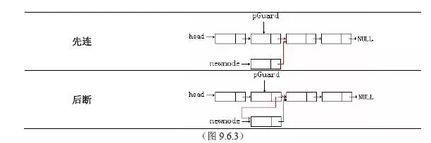
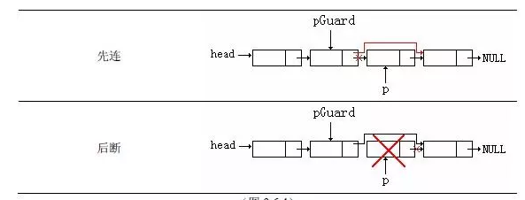
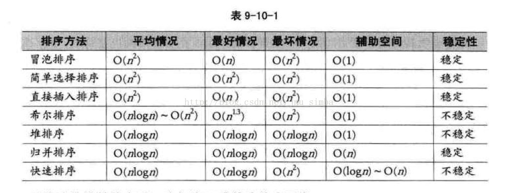

# 面试中常见的算法与数据结构考点

### 树

***二叉树的结构，二叉查找树的实现；**

二叉树是一种由节点和连接节点的连线组成，二叉树一个父节点最多可连接两个子节点，分别称为左子节点和右子节点，并且二叉树有且仅有一个根节点。

二叉查找树是在二叉树的基础上为每个节点添加了一个值的属性，并且根据值的大小来按序排列节点。二叉查找树特点是：

> 一个节点的左子树上的任意节点值均小于该节点的值，右子树上的任意节点值均大于该节点的值。
>
> 在节点随机输入产生的二叉查找树中进行查找，删除等操作的时间复杂度为O(logN)。
>
> 最坏情况下，查找、删除等操作的时间复杂度为O(N)。


***二叉树的六种遍历（递归、非递归）**

节点：

```c++
struct TreeNode{
	int val;        //节点值
	TreeNode* left; //左子节点
	TreeNode* right;//右子节点	
	TreeNode(int v):val(v){ };
}
```

先序遍历

```c++
//递归
void pre_order(TreeNode* root){
    if(root!=nullptr){
     	cout<<root->val;
        pre_order(root->left);
        pre_order(root->right);
    }
}

//非递归 stack实现
void pre_order(TreeNode* root){
    if(root!=nullptr){
        stack<TreeNode*> stack_tree;
        stack_tree.push(root);
        TreeNode* cur;
        
        while(!stack_tree.empty()){
            cur = stack_tree.top();
            stack_tree.pop();
            cout<<cur->val<<endl;
            
            if(cur->right!=nullptr)
                stack_tree.push(cur->right);
            if(cur->left!=nullptr)
                stack_tree.push(cur->left);
        }
    }
}
```

中序遍历

```c++
//递归
void mid_order(TreeNode* root){
    if(root!=nullptr){
        pre_order(root->left);
     	cout<<root->val;
        pre_order(root->right);
    }
}

//非递归 栈实现
void mid_order(TreeNode* root){
    if(root!=nullptr){
        stack<TreeNode*> stack_tree;
        TreeNode* cur = root;
        while(!stack_tree.empty()||cur!=nullptr){
            while(cur!=nullptr){
                stack_tree.push(cur->left);
                cur = cur->left;
            }
            cur = stack_tree.top();
            stack_tree.pop();
            cout<<cur->val<<endl;
            
            if(cur->right!=nullptr)
                stack_tree.push(cur->right);    
        }
    }
}

```

后序遍历

```c++
//递归
void pos_order(TreeNode* root){
    if(root!=nullptr){
        pre_order(root->left);
        pre_order(root->right);
        cout<<root->val;
    }
}

//非递归 stack实现
void pre_order(TreeNode* root){
    if(root!=nullptr){
        stack<TreeNode*> stack_tree1,stack_tree2;
        stack_tree1.push(root);
        TreeNode* cur;
        
        while(!stack_tree1.empty()){
            cur = stack_tree1.top();
            stack_tree1.pop();
            stack_tree2.push(cur);
            
            if(cur->left!=nullptr)
                stack_tree1.push(cur->left);
            if(cur->right!=nullptr)
                stack_tree1.push(cur->right);
        }
        while(!stack_tree2.empty()){
            cur = stack_tree2.top();
            stack_tree2.pop();
            cout<<cur->val<<endl;
        }   
    }
}
```


***二叉树的层遍历**

```c++
//采用队列实现
void layer_order(TreeNode* root){
    if(root!=nullptr){
        queue<TreeNode*> queue_tree;
        queue_tree.push(root);
        TreeNode* cur;
        
        while(!queue_tree.empty()){
        	cur = queue_tree.fornt();
            queue_tree.pop();
            cout<<cur->val<<endl;
            
            if(cur->left!=nullptr)
                queue_tree.push(cur->left);
            if(cur->right!=nullptr)
                queue_tree.push(cur->right);      
        } 
    } 
}  
```


***什么是红黑树，红黑树与AVL树的区别**


### 链表

***单向链表的插入、删除操作；双向的呢？**

单向链表结构

```c++
struct LinkNode{
	int val;
	LinkNode* next;
    LinkNode(int v):val(v){ };
}
```

单向链表的插入与删除

插入：



删除:



```c++
//在pos位置上插入新节点，其元素值为val，返回指向链表头的指针
LinkNode* insert_Node(LinkNode* ptr,int val,size_t pos){ 
    LinkNode *in_ptr = new LinkNode(val); 
    if(pos==1){
        in_ptr->next = ptr;
        return in_ptr;
    }else{
        LinkNode* root = ptr;
      	pos=pos-2; 
    	while(pos--){
            if(ptr!=nullptr)
        		ptr = ptr->next;
            else
                return nullptr; // 这里说明pos的值大于链表的长度，则返回nullptr
    	}        
        in_ptr->next = ptr->next;
        ptr->next = in_ptr;
        return root;
    }   
}

//删除pos位置上的节点，并返回指向链表头的指针
LinkNode* delete_Node(LinkNode* ptr ptr,int val,size_t pos){ 
	if(pos==1){
        LinkNode* out_ptr=ptr->next;
        delete ptr;
        return out_ptr;
    }else{
        LinkNode* root = ptr;
      	pos=pos-2; 
    	while(pos--){
            if(ptr!=nullptr)
        		ptr = ptr->next;
            else
                return nullptr; // 这里说明pos的值大于链表的长度，则返回nullptr
    	}  
		LinkNode* ptr_tmp = ptr->next;
        ptr->next = ptr->next->next;
        delete ptr_tmp;
        return root;
    }   
}
```


双向链表的结构

```c++
struct DoubleLinkNode{
	int val;
	LinkNode* next;
    LinkNode* pre;
    LinkNode(int v):val(v){ };
}
```


双向链表的插入、删除元素

```c++
//插入元素
DoubleLinkNode* insert_Node(DoubleLinkNode* ptr,int val,size_t pos){ 
    DoubleLinkNode *in_ptr = new DoubleLinkNode(val); 
    if(pos==1){
        in_ptr->next = ptr;
        in_ptr->pre = nullptr;
        ptr->pre = in_ptr;
        return in_ptr;
    }else{
        LinkNode* root = ptr;
      	pos=pos-2; 
    	while(pos--){
            if(ptr!=nullptr)
        		ptr = ptr->next;
            else
                return nullptr; // 这里说明pos的值大于链表的长度，则返回nullptr
    	}        
        in_ptr->next = ptr->next;
        in_ptr->next->pre = in_ptr;
        in_ptr->pre = ptr;
        ptr->next = in_ptr;
        
        return root;
    }   
}

//删除pos位置上的节点，并返回指向链表头的指针
DoubleLinkNode* delete_Node(DoubleLinkNode* ptr ptr,int val,size_t pos){ 
	if(pos==1){
        LinkNode* out_ptr = ptr->next;
        out_pre->pre = nullptr;
        
        delete ptr;
        return out_ptr;
    }else{
        LinkNode* root = ptr;
      	pos=pos-2; 
    	while(pos--){
            if(ptr!=nullptr)
        		ptr = ptr->next;
            else
                return nullptr; // 这里说明pos的值大于链表的长度，则返回nullptr
    	}  
        ptr->next->next->pre=ptr;
        ptr->next = ptr->next->next;
        delete ptr_tmp;
        return root;
    }   
}

```


***如何反向打印链表**

方式一：采用栈

```c++
void reverse_print(LinkNode* ptr){
    stack<LinkNode*> stack_link;
    while(ptr!=nullptr){
        stack_link.push(ptr);
        ptr=ptr->next;
    }
    linkNode* cur;
    while(!stack_link.empty()){
        cur = stack_link.top();
        stack_link.pop();
        cout<<cur->val<<endl;
    }
}
```

方式二：采用递归

```c++
void reverse_print( LinkNode* p){
    LinkNode* ptr = p;
    if(ptr->next!=nullptr){
        reverse_print(ptr->next);
    }
        cout<<ptr->val<<endl;    
}

```


***判断链表是否有环**

设置两个指针 `fast_ptr`和`slow_ptr`;

`fast_ptr`在后，并且一次移动向后移动两个节点，`slow_ptr`在前，一次向后移动一个节点，如果链表有环，则`fast_ptr`与`slow_ptr`总会在某次移动后相等

***判断链表是否相交**

当链表相交后，后续节点将完全相同，形成一个Y字型结构。

方式1：采用栈，使用两个栈，将两个链表的元素分别压入栈中，最后分别弹出两栈中第一个元素，若相同，则两链表相交；若不同，则链表不相交。


### 队列

***队列和栈的区别**

（1）从特点上看，队列的特性是先进先出（在表的一端插入，在另一端输出），而栈的特点是先进后出（只能在一端插入、输出）。

（2）应用场景上：在搜索变量上，队列主要用在层优先搜索上，而栈用在深度优先搜索；在操作系统中，队列主要用来管理系统的各种资源的分配执行顺序，资源缓存等，而栈主要是用来存储程序执行的指令及局部变量。

（3）顺序栈能够实现多栈的空间共享，而顺序队列不行。


### Hash表

***简单介绍一下hash表，怎么实现一个hash表**

hash表是一种字典结构，其主要特点是能够提供常数时间的基本操作。

其主要实现是通过哈希映射来实现，常用的哈希映射比如说取余操作。

举个例子：比如说现在有10个任意的非常大的数需要存储，现在共有100个存储块，那么我将这10个数每个数除以100然后取余，余数对应着存储块的编号，就将这个数存放在余数对应编号的存储块中。下次需要查找其中某个数的位置，直接对数字取余即可找到相应的位置块，操作的时间复杂度为常数。

hash表存在的一个问题就是**碰撞**的问题，就比如说刚刚若10个较大的数取余后都相等，那么不可能将10个数放在同一个存储块中吧，因此采用的办法通常是线性探测，就是如果取余后发现余数对应的存储块已经被占据了，那么就向后移动查找，直至找到一个未被使用的存储块，然后存储。这种方法有很多问题，可能会造成数据过度集中在一块，从而性能变差，改进方法又提出了二次探测，二次探测就是在方式碰撞时，对向后移动查找的步长做了限制。

还有一种实现hash表的方式就是**开链**；这种方式使用了链表，若发生碰撞时，则采用链表的形式在该存储块上采用链表结构，将数据串联起来。


***STL中hash_map扩容时发生什么**


### 海量数据问题

***十亿整数中最大的K个数（top K）**

（分组处理）：将十亿个整数分为1000组，对每一组进行单独的处理，找到每一组中最大的K个，然后对1000*K个数再进行分组，再次找到每组中最大的K个，直达一次性能够处理足够大的数据时，排序找到最大的K个即可。

大数据排序的思路： 先哈希将数据分成N个文件（哈希的好处是分布均匀，相同的数在同一个文件里），然后小文件装入内存进行快排，排序结果输出到文件，采用归并的方式合并文件，直至找出最大的K个。


***十亿整数中出现频率最高的1000个数**

思路大致相同，每一组处理的时候采用map<key,val>,key代表数据，val代表出现的次数。

### 排序算法





***归并排序**

时间复杂度： 最差： `O(nlogn)`  ；   平均：`O(nlogn)`；    最优：`O(nlogn)`

辅助空间:O(n)

稳定性：稳定

```c++
A[1,2,3,....] //待排数组
A.length     //数组长度

//伪代码
merge_sort(A,p,q,r){
    len1 = q-p+1;
    len2 = r-(q+1)+1;
    
    for i = 1 to len1
        array1[i] = A[p-i+1];
    for k = 1 to len2
        array2[k] = A[q+1-k+1];
    
    m=1;
    n=1;
    
    for x = p to r
        if array1[m]>array2[n]
            A[x]=array2[n];
    		n++;
    	else
            A[x]=array1[m];
    		m++;    
}

Merge_Sort(A,p,r){
    if p<r
		q = floor((p+r)/2);
    	Merge_Sort(A,p,q);
    	Merge_Sort(A,q+1,r);
    	merge_sort(A,p,q,r);
}
```


***快速排序**

时间复杂度： 最差： `O(n^2)`  ；   平均：`O(nlogn)`；    最优：`O(nlogn)`

辅助空间:`O(logn)~O(n)`

稳定性：不稳定

```c++
A[1,2,3,....] //待排数组
A.length     //数组长度

//伪代码
int quick_sort(A,p,r){
    key = A[r];
    pos = p-1;
    
    for i = 1 to r-1
        if A[i]<A[pos]
            pos++;
    		swap(A[pos],A[i]);
    swap(A[r],A[++pos]);
    return pos; 
}

Quick_Sort(A,p,r){
    if p<r
        q = quick_sort(A,p,r);
    	Quick_Sort(A,p,q);
    	Quick_Sort(A,q+1,r);
}
```

最差的情况就是每次选择的key值都是最大（最小），最优的情况是每一次选择都是中间值。因此为了提高性能采用的办法是三个点取中值，每次在begin、mid、end三个值上取中值作为key。


***堆排序**

时间复杂度： 最差： `O(nlogn)`  ；   平均：`O(nlogn)`；    最优：`O(nlogn)`

辅助空间:`O(1)`

稳定性：不稳定

```c++
//堆排序首先要实现 建立堆 和维护堆
A[1 2 ....] //待排数组
A.length    //数组长度
A.heap_size  //堆的大小
    
//伪代码    
max_heapfy(A,i){
	l = left(i);
	r = right(i);
	
	if l<=A.heap_size&&A[l]>A[i]
		largest = l;
	else
		largest = i;
		
	if r<=A.heap_size&&A[r]>A[largest]
		largest = r;
		
	if(largest!=i)
		swap(A[largest],A[i]);
		max_heapfy(A,largest);
}

build_max_heap(A){
	n = A.length;
	for i = n to 1
		max_heapfy(A,i);
}

Heap_Sort(A){
	build_max_heap(A);
	n = A.length;
	for i = n to 1
		swap(A[1],A[i])
		A.length = A.length-1;
		max_heapfy(A,1);
}

```


