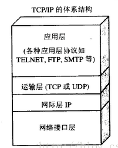
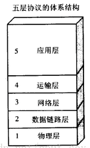
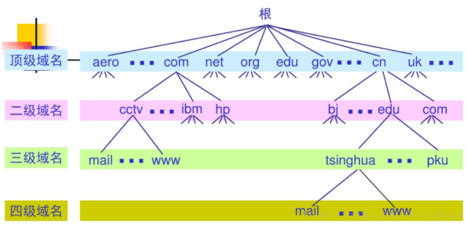
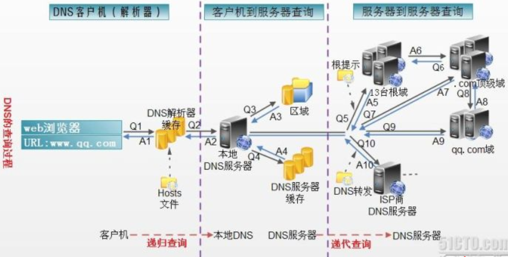
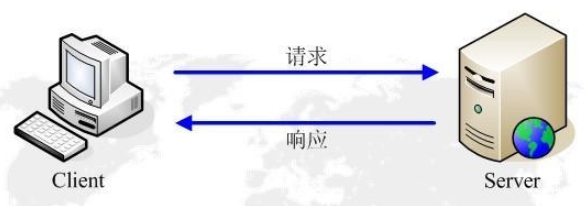
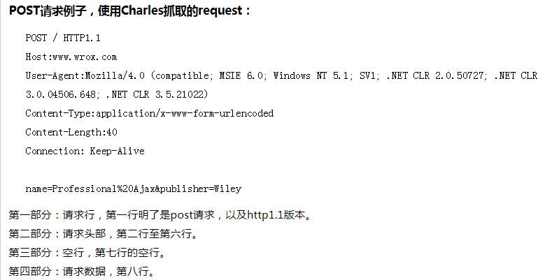
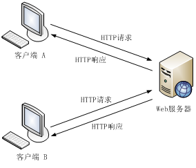
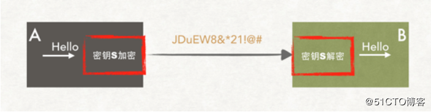
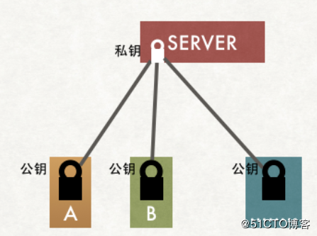
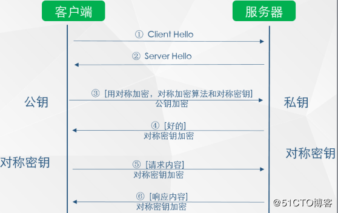

# 计算机网络常见面试考点

### 计算机网络的体系结构

***OSI七层体系结构**


***TCP/IP四层体系结构**




***五层协议的体系结构**




### 应用层相关

应用层的具体内容就是规定不同应用进程之间通信时所遵循的协议。


***万维网www**

万维网是一个大规模、联机式的信息存储所所，简称web；本质上是一个分布式的超媒体系统，它是超文本系统的扩充。超文本就是包含指向其它文档的链接的文本。


网页浏览的过程：以客户程序向服务器程序发出请求，服务器程序向客户程序返回一个万维网文档；

网页：就是在一个客户端程序上显示的万维网文档。


***万维网需要解决的问题**

1）如何标记分布在整个因特网上的所有万维网文档

使用统一资源定位符(URL,uniform resource locator)。

2）采用什么协议来实现万维网上的各种连接

采用超文本传输协议协议（HTTP）。


***统一资源定位符（URL,uniform resource locator）**

是因特网上用来得到资源位置和访问资源的方法接口。

格式： <协议>://<主机>:<端口号>/<路径>


例如：

http://www.baidu.com   一般端口号和主机名可省略，因为端口号和应用进程绑定在一起，http协议固定的端口号为80。

ftp://168.123.124.101  采用ftp协议。


URL相当于是一个文件名在网络上的扩展


***域名系统DNS**

`DNS(domain name systems)`是因特网使用的命名规则，功能是用来把用户习惯使用的网址名称唯一转换成IP地址。


**因特网的域名结构：**




​                                                                    **... .mail.cctv.com**

com：顶级域名

cctv：二级域名

mail：三级域名

...

域名中每一个标号不超过63个字符，不区分大小写；完整的域名不超过255个字符。

各级域名由上一级域名统一管理，一旦某一个单位拥有了一个域名，就可以自行决定是否要进一步设定下一级域名，并不必向上级机构批准。


**域名服务器**

一个域名服务器所管辖的范围叫区，每个区设置有相应的权限域名服务器，保存该区中所有主机的域名与IP地址的映射关系。

1）根域名服务器：最高层次的域名服务器，根域名服务器分布在全球多个主要地点。

2）顶级域名服务器：负责管理该域名下注册的二级域名。

3）权限域名服务器：负责一个区的域名服务器。

4）本地域名服务器：负责管理本地域名。


**DNS解析流程**



说到DNS，还必须了解一个常见的`hosts文件`，该文件存储了部分用户常用的主机名和IP的映射表。

1）当用户在浏览器中输入一个网站时，从URL（统一资源定位符）中获取域名；

2）操作系统规定在解析域名时，首先在本地hosts文件中查找域名映射的IP；若找到则直接返回该IP，完成解析，否则查找本地DNS解析器缓存，如果找到则返回完成解析，否则向本地域名服务器发起请求（采用递归查找方式）；

3）本地域名服务器收到请求后，在服务器缓存中查找域名对应IP，若找到则向请求主机返回对应IP，否则向根服务器发起请求（采用迭代查找方式）；

4）根服务器收到请求后，会判断这个域名是由哪个机构管理的，并返回一个负责管理该顶级域名的顶级域名服务器的IP，本地DNS服务器收到此IP之后联系负责该顶级域名服务器。

5）该顶级域名服务器收到请求之后，如果自己无法解析，则它会找到一个管理二级域名服务器的IP返回给本地DNS服务器，当本地DNS服务器收到该IP后，再次向该二级域名服务器发起请求，这样迭代查询直至完成域名解析。

注意：（1）上面本地域名服务器未采用转发模式，如果采用转发模式，本地DNS服务器会将解析请求先发给上一级域名服务器，然后上一级域名服务器若仍无法解析则继续发给它的上一级域名服务器直至解析完成返回给本地DNS服务器。

（2）解析是否具有权威性是指如果是在本域名服务器存储的文件映射上完成的解析，则该解析具有权威性，如果是本地域名服务器缓存的由其它域名服务器完成的解析，这种解析则不具备权威性。


***HTTP协议**


HTTP是面向实物的应用层协议，采用了TCP可靠传输。

HTTP有多种版本，http1.0/http1.1/http2.0;

`http1.0`

HTTP协议工作在客户端-服务端（C/S）构架上，浏览器作为HTTP客户端通过URL向HTTP服务端（web服务器）发送请求，web服务器根据收到的请求作出响应，然后向客户端发送响应信息。



HTTP1.0主要特点：

1）无连接，虽然http采用了面向连接的TCP协议，但采用该协议仅是保证数据传输上的可靠性。但从本质上讲，http1.0一次连接只是客户端发送一次请求，服务器响应一次请求，之后便断开连接，因此认为http是无连接的。采用这种方式可以节省传输时间，减小资源损耗。

2）无状态，http是无状态协议，即对处理的事物没有记忆能力，即如果后续需要处理前面的信息，则必须重传，这样就可能导致每次连接传输的数据量比较大。但是在服务器不需要先前信息时其响应速度就很快了。

***HTTP的请求消息**

客户端发送一个请求消息给web服务器，请求消息包括四个部分：请求行、请求头部、空行、请求数据





***HTTP的响应消息**

一般情况下，在http服务端收到并处理完客户端的请求之后会返回一个HTTP响应消息

响应消息由四个部分组成：状态行、响应头部、空行、响应数据


***http的状态码**

```
200 OK                     //客户端请求成功
400 Bad Request            //客户端请求有语法错误，不能被服务器所理解
401 Unauthorized           //请求未经授权，这个状态代码必须和WWW-Authenticate报头域一起使用 
403 Forbidden              //服务器收到请求，但是拒绝提供服务
404 Not Found              //请求资源不存在，eg：输入了错误的URL
500 Internal Server Error  //服务器发生不可预期的错误
503 Server Unavailable     //服务器当前不能处理客户端的请求，一段时间后可能恢复正常
```

***http的请求方法**

```
GET     请求指定的页面信息，并返回实体主体。
HEAD     类似于get请求，只不过返回的响应中没有具体的内容，用于获取报头
POST     向指定资源提交数据进行处理请求（例如提交表单或者上传文件）。数据被包含在请求体中。POST请求可能会导致新的资源的建立和/或已有资源的修改。
PUT     从客户端向服务器传送的数据取代指定的文档的内容。
DELETE      请求服务器删除指定的页面。
CONNECT     HTTP/1.1协议中预留给能够将连接改为管道方式的代理服务器。
OPTIONS     允许客户端查看服务器的性能。
TRACE     回显服务器收到的请求，主要用于测试或诊断。
```


***HTTP的工作原理**



1）首先由一个http客户端（web浏览器）与http服务器（web服务器）通过（IP地址和端口号80的）套接字建立TCP连接。

2）连接建立好之后，由web浏览器向web服务器发送请求消息。

3）web服务器收到请求消息后进行处理，然后返回响应消息给web客户端。

4）若采用的http1.0为短连接模式，即connection模式为close，则服务器主动关闭TCP连接，客户端被动关闭TCP连接，释放TCP连接。若connection模式为keepalive，则服务器暂时不关闭TCP连接，该连接会保持一段时间，在这一段时间内仍可响应请求。

4）web客户端收到响应消息后，解析响应消息，查看状态行，若正确处理，则提取出响应消息中的html文件，然后将其显示在浏览器中。


> 例如：在浏览器地址栏键入URL，按下回车之后会经历以下流程：
>
> 1、浏览器向 DNS 服务器请求解析该 URL 中的域名所对应的 IP 地址;
>
> 2、解析出 IP 地址后，根据该 IP 地址和默认端口 80，和服务器建立[TCP连接](http://www.jianshu.com/p/ef892323e68f);
>
> 3、浏览器发出读取文件(URL 中域名后面部分对应的文件)的HTTP 请求，该请求报文作为 [TCP 三次握手](http://www.jianshu.com/p/ef892323e68f)的第三个报文的数据发送给服务器;
>
> 4、服务器对浏览器请求作出响应，并把对应的 html 文本发送给浏览器;
>
> 5、释放 [TCP连接](http://www.jianshu.com/p/ef892323e68f);
>
> 6、浏览器将该 html 文本并显示内容; 　　


***GET和POST请求的区别**

1）采用GET提交的方式时，其请求数据会直接附在URL之后；而采用POST提交方式时，请求数据会放在请求消息结构中的请求数据中。

2）由于URL存在长度的限制，因此采用GET方式提交会对请求数据的长度有限制；而POST方式提交则没有这种问题。

3）从安全性上看，由于GET方式直接将请求数据附在URL之后，因此安全性不如POST高。


***HTTP 1.1**

在http1.0协议之后出现了http1.1协议，http1.1版本主要是在http1.0的基础上对以下几个部分作了改进：

1）连接方式；http1.0只支持短连接，即一次连接过程中服务端响应一次请求后便会立即断开连接，若需要再次请求服务器数据需要重新建立http连接。而http1.1版本支持长连接和请求的流水线处理，在一个TCP连接上传送多个HTTP请求和响应，减少http连接建立和断开的消耗和延迟。在http1.1中默认开启connection：keep-alive，一定程度上弥补了http1.0每次请求都要创建连接的缺点。

2）host头处理；在http1.0中认为每一台服务器都绑定着唯一的一个IP地址，所以在请求消息中的URL并没有传递主机名（hostname），但后来随着虚拟主机技术的发展，在一台物理服务器上可以存在多个虚拟主机（multi-homed Web Servers），并且它们共享一个IP地址。因此http1.1的请求消息和响应消息都应支持host头域，且请求消息中如果没有host头域会报告一个错误。

3）断点续传；在http1.0中，如果客户端只是需要某个对象的一部分，而服务器却将整个对象传送过来了，并且不支持断点续传；http1.1在请求头中引入了range头域，它允许只请求资源的某个部分，即可实现断点续传。


***HTTP2.0**

虽然http1.1在连接上通过采用长连接的方式实现了比http1.0更高的效率，但是本质上还是没有解决串行阻塞的问题，比如当前一个http请求没有完成时，后续的http请求会被收到但不会被执行，必须等到正在执行的http响应后才能执行下一个响应。

http2.0与http1.x相比的新特性：

1）新的二进制格式；http1.x的解析是基于文本的，而http2.0的协议解析基于二进制格式，实现方便且健壮。

2）多路复用；一个request对应一个id，这样一个连接上可以有多个request，每个连接的request可以随机的混杂在一起，接收方可以根据request的 id将request再归属到各自不同的服务端请求里面。


***HTTPS协议**

web服务一般采用http和https这两种通信方式，http默认采用80作为通信端口，采用不加密方式传输；而https默认采用443端口，采用加密方式传输。出于安全的考虑，https目前为主流的web服务通信协议。

https本质上就是在http基础上增加了ssl协议层，对http传输的数据进行加密。


加密（对称加密/非对称加密）

1）对称加密




首先，客户端A和服务端B同时维护着一串相同的秘钥S，当客户端A需要发送Hello给服务端B时，会将需要发送的信息Hello采用加密算法进行加密（使用密约S），得到Hello的加密输出 JDuEW8&*21!@#，然后将该内容传输给服务端B，服务端B收到后采用解密算法进行解密（使用秘钥S），最终解密出明文信息Hello。

优点：加密解密速度快、效率高，适用于大量数据加密。

缺点：安全性不高，因为双方一旦有一方泄露了秘钥，将使整个通信过程暴露为可拦截可篡改，并且最开始密钥协商时，即当一方不知道秘钥时，需要将秘钥在网络上传输，存在泄露的风险。


2）非对称加密

服务端会维护一对秘钥（公钥和私钥），其中用公钥加密的密文只能用私钥来解密，反之亦然。服务端会将私钥保存在本地，由服务端自己管理，而公钥采用明文的方式发送给客户端，当客户端有信息需要发送给服务端时，将信息用公钥进行加密后传输给服务端，服务端收到后用本地的私钥进行解密得出明文。



优点：安全性高，由于私钥不需要在网络上传输因此私钥泄露的风险很小。

缺点：加密解密速度慢，不适合大批量数据传输。


那么如何安全并高效的进行网络数据传输呢？**结论是采用非对称加密算法加密对称加密算法的秘钥协商过程，然后用对称加密算法进行数据传输。**



1.首先由客户端发送连接请求，然后服务器收到后将公钥作为响应返回给客户端。

2.客户端产生一串对称加密使用的秘钥，然后将该秘钥用服务端传来的公钥进行加密，将加密后的秘钥发送给服务端。

3.服务端收到该加密后的秘钥后，用私钥进行解密，解出客户端发送的秘钥。

4.之后客户端和服务器就采用该秘钥进行对称加密方式的数据传输。


那么如何安全的获取公钥？

考虑下图这种情况


当发送中间拦截替换时，如何保证客户端能够安全的获得公钥并保证该公钥是正确的？

这个时候就需要用到**SSL证书**和**CA机构**！


1）当客户端发送连接请求后，服务端会响应一个SSL证书给客户端，该SSL证书中包含的内容有证书的颁发机构、有效期、公钥、证书持有者、签名。通过这样一种第三方校验的方式保证身份的合法性，解决公钥获取的安全性问题。

2）当web客户端收到该证书后会读取证书中的信息进行一一校验。

3）浏览器开始查找操作系统中已内置的受信任的证书发布机构CA，与服务器发来的证书中的颁发者CA比对，用于校验证书是否为合法机构颁发。

4）如果找不到。浏览器就会报错，说明服务器发来的证书是不可信任的。

5）如果找到了，那么浏览器就会从操作系统中取出颁发者CA的公钥，然后对服务器发来的证书里面的签名进行解密

6）浏览器使用相同的hash算法计算出服务器发来的证书的hash值，将这个计算的hash值与证书中签名做对比

7）对比结果一致，则证明服务器发来的证书合法，没有被冒充

8）此时浏览器就可以读取证书中的公钥，用于后续加密了


**总结**：https要使客户端和服务器的通信过程得到安全保证，就要使用对称加密算法，但对称加密算法过程中的秘钥协商过程需要使用非对称加密算法来保证其安全，而直接使用非对称加密算法过程本身也不安全，会有中间人篡改公钥的可能性，所以客户端和服务器之间不直接使用公钥，而是使用数字证书签发机构颁发的证书来保证非对称加密过程的安全，通过这样一种秘钥协商过程协商出一个加密算法，然后用该加密算法来进行加密解密，从而保证了客户端与服务端之间通信的安全问题。


### 传输层相关

### 网络层相关

### 数据链路层相关

### 物理层相关